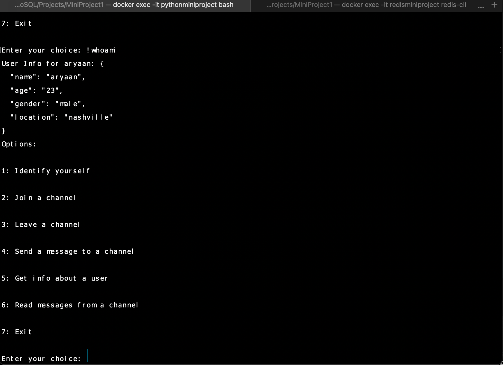

# Chatbot using Redis Pub/Sub

## Overview

This project is a simple chatbot implemented in Python that utilizes Redis's publish and subscribe feature. The chatbot supports user registration, joining and leaving channels, sending messages, and retrieving weather information alongisde fun facts (based on preset information) . It interacts with users via the command line interface.

## Features

- User registration with details (username, age, gender, location)
- Join and leave channels
- Send and read messages in channels
- Retrieve weather information for a specific city (based on preset data)
- Get random fun facts (based on preset data)
- Display user information from Redis Database

## Prerequisites

Before running the chatbot, ensure you have the following libraries installed:

- Required Python libraries (`redis`, `json`, `random`)

## Running the Chatbot

- install and run the required docker yml file using "docker compose up"
- Please make sure to correct the volumes field for the directories in the docker compose file -> change it toreflect the local machine's directory where the file is stored
- Access the bash window of the python environment using the command "docker exec -it pythonminiproject bash"
- Run the python script using "python mp1_template.py"
- Open a new terminal at the folder in whcih the files are stored and run the command "docker exec -it redisminiproject redis-cli"
- In the redis cli, type "monitor"
- Now you can view the updates in real time and see how the user uses the chatbot

## Usage

Once the chatbot is running, you will see an introduction and a menu of options. You can enter the corresponding number for the action you want to perform or type commands that start with `!` (e.g., `!help`, `!weather <city>`, `!fact`, `!whoami`).

### Commands

- Identify yourself
- Join a channel
- Leave a channel
- Send a message to a channel
- Get info about a user
- Read messages from a channel
- Exit

## Code Structure

### `Chatbot` Class

The `Chatbot` class contains methods for handling user interactions and utilizing Redis Pub/Sub features:

- `__init__(self, host='redis', port=6379)`: Initializes the Redis client and attributes.
- `introduce(self)`: Provides an introduction and lists commands.
- `display_options(self)`: Displays available options to the user.
- `identify(self, username, age, gender, location)`: Registers a user in the Redis database.
- `join_channel(self, channel)`: Subscribes the user to a specified channel.
- `leave_channel(self, channel)`: Unsubscribes the user from a specified channel.
- `send_message(self, channel, message)`: Sends a message to a specified channel.
- `read_message(self, channel)`: Reads messages from a specified channel.
- `process_commands(self, message)`: Processes special commands not part of Pub/Sub.
- `get_weather(self, city)`: Retrieves preset weather information for a city.
- `get_fact(self)`: Returns a random fun fact.
- `whoami(self)`: Displays user information.
- `menu(self)`: Main loop for user interaction.

### `add_mock_weather_data()`

This function adds mock weather data to Redis for testing purposes.

## Conclusion

This chatbot provides a simple yet effective demonstration of how to use Redis's Pub/Sub feature for real-time communication in a command-line environment. As it is simple there is a lot of scope for improvement. For example, for the weather feature, the model can be solidified using the weather API calls.

## Screenshots

- Initial introduction and set up
  

- Storing information for user
  

- !Whoami
  
  

- Sending message to a channel
  

- Joining a channel
  
  

## Use of Genrative AI

I used generative AI to give me an outlook as to what a good readme file looks like in terms of what a person who is not aware of this project would look towards for guidance. I also used generative AI to understand debug the code that was given to us in the class demos for redis. This helped me understand how I should approach this question and what it should look like from the developer's point of view.
